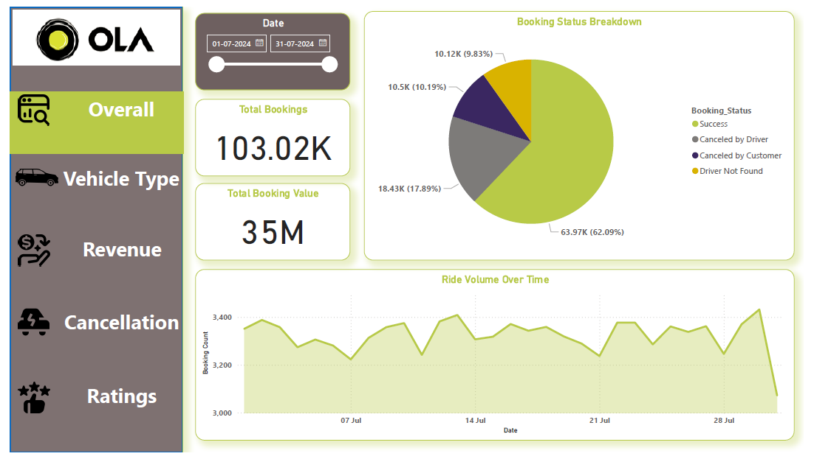
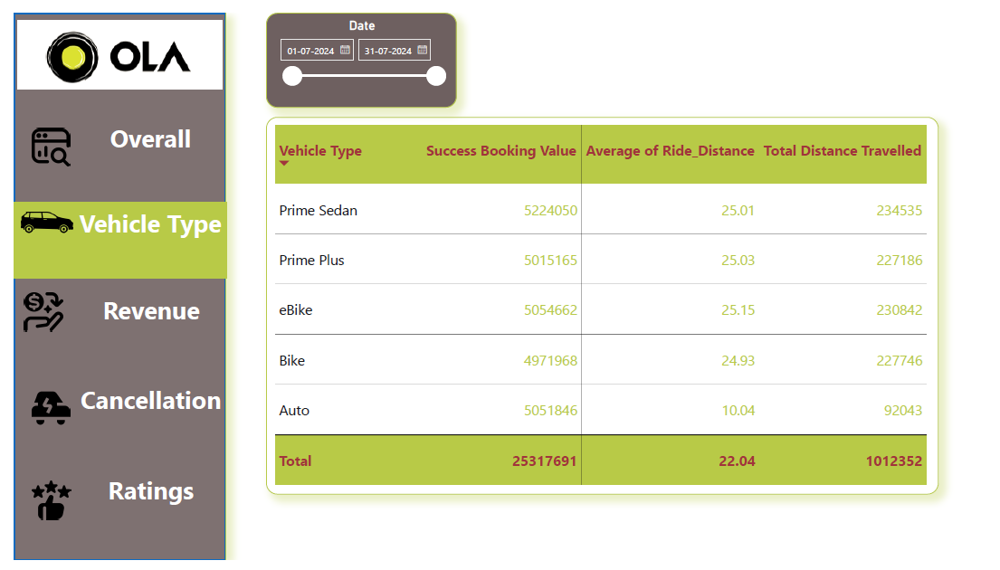
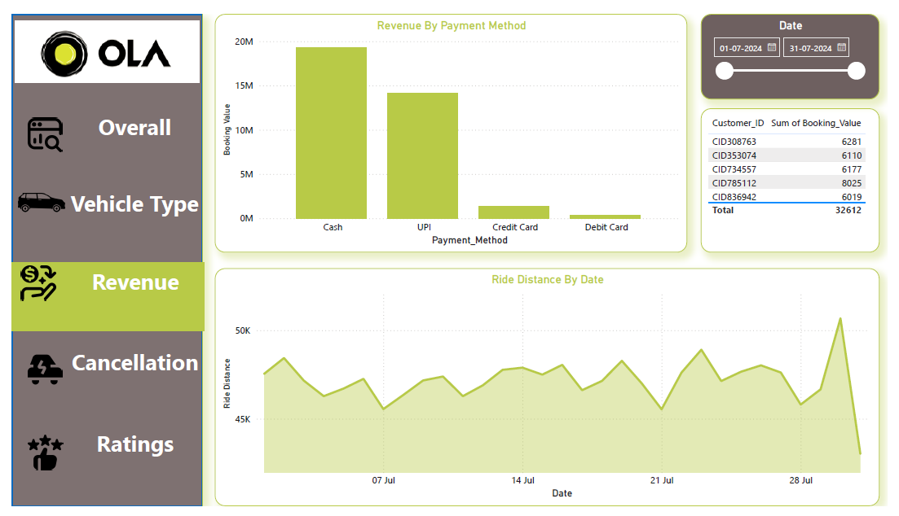
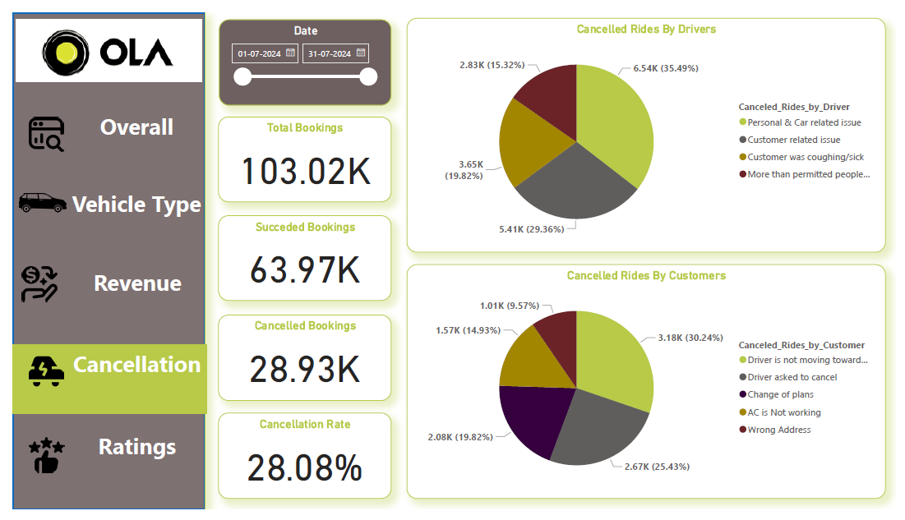
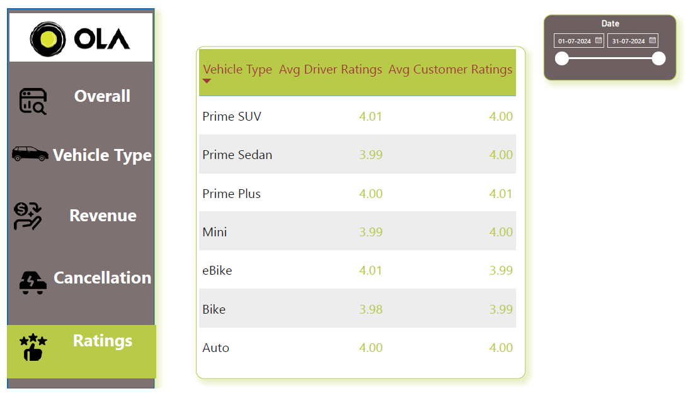

# 🚖 OLA Ride Booking Analysis Dashboard


## 📌 Project Overview

This project is an end-to-end Power BI dashboard developed to analyze OLA ride booking performance and provide business insights into customer behavior, booking trends, cancellations, revenue generation, vehicle performance, and customer satisfaction.

The dashboard enables business stakeholders to monitor operational KPIs and identify opportunities to improve ride completion rates, customer experience, and overall business performance.

---

# 🎯 Business Problem

Ride-hailing companies process thousands of bookings every day. Without a centralized analytics dashboard, it becomes difficult to monitor business performance, identify cancellation patterns, evaluate customer satisfaction, and optimize operational efficiency.

This dashboard addresses these challenges by providing interactive visualizations and KPIs that support data-driven decision making.

---

# 🎯 Business Objectives

- Monitor overall booking performance
- Track revenue generated from bookings
- Analyze cancellation trends
- Evaluate customer and driver ratings
- Compare vehicle category performance
- Monitor booking trends over time
- Understand payment preferences
- Improve operational efficiency

---

# 🛠️ Tools & Technologies

- Power BI Desktop
- Power Query
- DAX
- CSV Dataset
- Data Visualization

---

# 📂 Dataset Information

**Source:** CSV File

**Records:** Approximately **103,000 ride bookings**

The dataset includes information related to:

- Booking ID
- Booking Status
- Booking Value
- Date & Time
- Customer ID
- Vehicle Type
- Pickup Location
- Drop Location
- Ride Distance
- Payment Method
- Customer Rating
- Driver Rating
- Cancellation Reasons
- Incomplete Ride Reasons

---

# 🧹 Data Preparation

Data preprocessing was performed using **Power Query**.

Cleaning steps included:

- Importing CSV data
- Promoting first row as headers
- Assigning appropriate data types
- Preparing fields for reporting

---

# 📊 Dashboard Pages

## 1️⃣ Overall Dashboard


Provides a high-level business summary including:

- Total Bookings
- Booking Value
- Booking Status Distribution
- Daily Booking Trend

---

## 2️⃣ Vehicle Type Analysis


Analyzes

- Vehicle-wise bookings
- Revenue contribution
- Ride volume
- Customer preference by vehicle category

---

## 3️⃣ Revenue Dashboard


Tracks

- Revenue generated
- Payment methods
- Booking value
- Revenue distribution

---

## 4️⃣ Cancellation Dashboard


Analyzes

- Customer cancellations
- Driver cancellations
- Cancellation percentage
- Cancellation reasons

---

## 5️⃣ Ratings Dashboard


Monitors

- Customer Ratings
- Driver Ratings
- Overall service quality

---

# 📈 Key KPIs

- Total Bookings
- Successful Bookings
- Cancelled Bookings
- Cancellation Percentage
- Total Booking Value
- Ride Distance
- Customer Rating
- Driver Rating

---

# ⚙️ DAX Measures Used

Examples include

```DAX
Total Bookings =
COUNTROWS(Bookings)
```

```DAX
Cancelled Bookings =
CALCULATE(
    COUNTROWS(Bookings),
    Bookings[Booking_Status]
        IN {
            "Canceled by Driver",
            "Canceled by Customer"
        }
)
```

```DAX
Cancelled Percentage =
DIVIDE(
    [Cancelled Bookings],
    [Total Bookings],
    0
)
```

---

# 📊 Business Insights

Some of the major insights generated include:

- Booking demand fluctuates throughout the month.
- Cancellation rates significantly impact ride completion.
- Customer and driver cancellation reasons differ and require separate operational strategies.
- Vehicle categories contribute differently to business performance.
- Customer satisfaction can be monitored using rating trends.
- Payment method preferences reveal customer behavior.

---

# 💡 Business Recommendations

- Reduce driver-side cancellations through incentive programs.
- Investigate high customer cancellation reasons.
- Improve vehicle allocation during peak demand.
- Monitor low-rated drivers for quality improvement.
- Optimize payment options based on customer usage.

---

# 📁 Repository Structure

```
ola-data-analysis-dashboard/

│── Dashboard.pbix
│── Bookings.csv
│── README.md
│── Images/
│── Screenshots/
```

---

# 👨‍💻 Skills Demonstrated

- Business Intelligence
- Data Visualization
- Dashboard Design
- KPI Development
- DAX
- Power Query
- Data Cleaning
- Business Analytics
- Data Storytelling

---

# 📬 Contact

**Garvit Agrawal**

MBA (Marketing & IT)

Data Analyst | Power BI | SQL | Excel

LinkedIn:
linkedin.com/in/garvit-agrawal05

GitHub:
https://github.com/garvit-analytics
